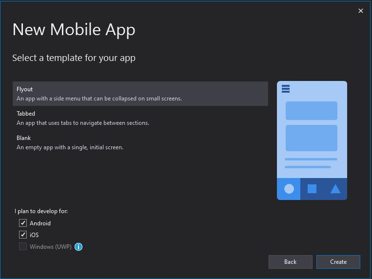
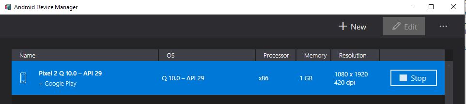
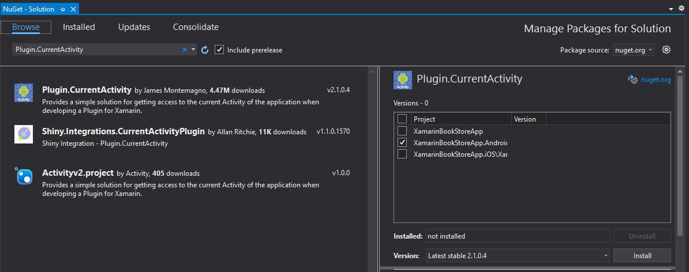
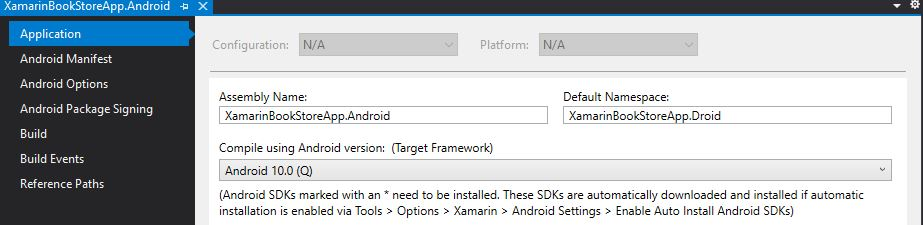
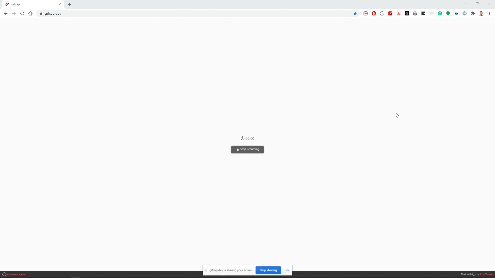

## ABP Framework API consumed by a Xamarin.Forms application

## Introduction

This article is about how you can **connect a Xamarin.Forms application to an ABP Framework application and consume its API**. For this article I created an ABP Framework application with a separate IdentityServer project and a Blazor UI and added the Books BookStore functionality from the ABP Framework tutorial.

A special thanks goes to **Anton Wieslander** from the [Raw Coding](https://www.youtube.com/c/RawCoding) YouTube channel, where he explains in [Episode.21.2 Xamarin]([https](https://www.youtube.com/watch?v=McTTgj7NEf0&list=PLOeFnOV9YBa7dnrjpOG6lMpcyd7Wn7E8V&index=25&ab_channel=RawCoding))  how to configure **a Xamarin.Forms app to connect to IdentityServer4**.

As I don't have an IPhone or MacBook in my possession, I wrote and tested the Xamarin.Forms app only with an Android Device in the Android Device Emulator. The code needed to connect from an IPhone you will need to write yourself.

Be careful to use this IdentityServer setup, because I only tested it in a development environment. If you copy code from this article into an application it is at your own risk, I can never be held responsible for possible bugs, security breaches or any problem you run in to.

### Source Code

The Source code of the completed application is [available on GitHub](https://github.com/bartvanhoey/AbpApiConsumedByXamarin).

## Requirements

The following tools are needed to be able to run the solution and follow along. You will also need to have Visual Studio set up for Xamarin.Forms development.

* .NET 5.0 SDK
* Visual Studio 2019 16.8.0+ with Xamarin setup and Android SDK 10.0-Q - API 29

## Setup BookStore API and IdentityServer

### Create a new ABP project with a separate IdentityServer project

```bash
    abp new XamarinBookStoreApi -u blazor -o XamarinBookStoreApi --separate-identity-server
```

### Find your IP address

Open a command prompt and enter `ipconfig` to fin you IP address.

### replace all instances of localhost with your IP address

Hit CTRL+SHIFT+H to replace all localhost instances in the XamarinBookStoreApi project with your IP address. You need to replace them because the Xamarin.Forms app mixes up localhost from the API with localhost from the Xamarin.Forms app.

```bash
    https://192.168.1.108:44349" => "https://192.168.1.108:44349"
```


### Add XamarinBookStoreApi_Xamarin section in appsettings.json file of the XamarinBookStoreApi.DbMigrator project

```json
      "XamarinBookStoreApi_Xamarin": {
        "ClientId": "XamarinBookStoreApi_Xamarin",
        "ClientSecret": "1q2w3e*",
        "RootUrl": "https://<your-ip-address>:<port-identityserver>" 
        // RootUrl = "AuthServer:Authority": "https://192.168.1.108:44349" in appsettings.json HttpApi.Host project
      }
```

### Add Xamarin client IdentityServer configuration

In the CreateClientAsync method in class IdentityServerDataSeedContributor of the XamarinBookStoreApi.Domain project.

```csharp
  // Xamarin Client
  var xamarinClientId = configurationSection["XamarinBookStoreApi_Xamarin:ClientId"];
  if (!xamarinClientId.IsNullOrWhiteSpace())
  {
      var xamarinRootUrl = configurationSection["XamarinBookStoreApi_Xamarin:RootUrl"].TrimEnd('/');

      await CreateClientAsync(
          name: xamarinClientId,
          scopes: commonScopes,
          grantTypes: new[] { "authorization_code" },
          secret: configurationSection["XamarinBookStoreApi_Xamarin:ClientSecret"]?.Sha256(),
          requireClientSecret: false,
          redirectUri: "xamarinformsclients://callback",
          corsOrigins: new[] { xamarinRootUrl.RemovePostFix("/") }
      );
  }
```

### Update method ConfigureAuthentication of the XamarinBookStoreApiHttpApiHostModule in HttpApi.Host project

To overcome issue _System.InvalidOperationException: IDX20803: Unable to obtain configuration from: 'System.String'.
 ---> System.IO.IOException: IDX20804: Unable to retrieve document from: 'System.String'_  update the ConfigureAuthentication method.

WARNING: Do this only in a development environment, not in a production environment!

```csharp
    private void ConfigureAuthentication(ServiceConfigurationContext context, IConfiguration configuration)
    {
      context.Services.AddAuthentication(JwtBearerDefaults.AuthenticationScheme)
          .AddJwtBearer(options =>
          {
            // ...
            
            options.BackchannelHttpHandler = new HttpClientHandler
            {
              ServerCertificateCustomValidationCallback = HttpClientHandler.DangerousAcceptAnyServerCertificateValidator
            };
          });
    }
```

### Books BookStore tutorial

To have a simple API that can be consumed by the Xamarin.Forms app, I added the Books Bookstore code from the BookStore Tutorial (Part1-5).

Open a command prompt in the DbMigrations project and run the command below to add a migration.

```bash
    dotnet ef migrations add BookEntityAdded
```

### DbMigrations

Run the XamarinBookStoreApi.DbMigrator project to apply the database migrations.

### Run IdentityServer, Api and Blazor project

Start the IdentityServer, API and Blazor project to see if all projects run successfully.

## Xamarin.Forms app

### Create a Xamarin.Forms app and setup the basic project structure

#### Create a new Xamarin app in Visual Studio (Flyout template)



#### Update Nuget Packages

I updated the following nuget packages in the Xamarin.core project and the Android.project.

```bash
    Xamarin.Forms" Version="5.0.0.2012
    Xamarin.Essentials" Version="1.6.1
```

#### Add a FlyoutItem in file AppShell.xaml of the XamarinBookStoreApp core project

```html
    <FlyoutItem Title="IdentityServer" Icon="icon_identity_server.png">
        <ShellContent Route="IdentityConnectPage" ContentTemplate="{DataTemplate local:IdentityConnectPage}" />
    </FlyoutItem>
    // ... other FlyoutItems here
```

#### Add a new ContentPage IdentityConnectPage.xaml in the Views folder of the XamarinBookStoreApp core project

```html
  <?xml version="1.0" encoding="utf-8" ?>
  <ContentPage xmlns="http://xamarin.com/schemas/2014/forms"
              xmlns:x="http://schemas.microsoft.com/winfx/2009/xaml"
              x:Class="XamarinBookStoreApp.Views.IdentityConnectPage"
                Title="{Binding Title}">
      <ContentPage.Content>
          <StackLayout Padding="10,0,10,0" VerticalOptions="Center">
              <Button VerticalOptions="Center" Text="Connect" Command="{Binding ConnectToIdentityServerCommand}"/>
          </StackLayout>
      </ContentPage.Content>
  </ContentPage>
```

#### Set BindingContext in IdentityConnectPage.xaml.cs in the Views folder

```csharp
  using Xamarin.Forms;
  using Xamarin.Forms.Xaml;
  using XamarinBookStoreApp.ViewModels;

  namespace XamarinBookStoreApp.Views
  {
      [XamlCompilation(XamlCompilationOptions.Compile)]
      public partial class IdentityConnectPage : ContentPage
      {
          public IdentityConnectPage()
          {
              InitializeComponent();
              this.BindingContext = new IdentityConnectViewModel();
          }
      }
  }
```

#### Create a new file IdentityConnectViewModel.cs in the ViewModels folder of the XamarinBookStoreApp project

```csharp
using System;
using Xamarin.Forms;

namespace XamarinBookStoreApp.ViewModels
{
    public class IdentityConnectViewModel : BaseViewModel
    {
        public Command ConnectToIdentityServerCommand { get; }

        public IdentityConnectViewModel()
        {
            Title = "IdentityServer";
            ConnectToIdentityServerCommand = new Command(ConnectToIdentityServer);
        }

        private void ConnectToIdentityServer(object obj)
        {
            throw new NotImplementedException();
        }
    }
}
```

#### Run the Xamarin.Forms

Open the Android Device Manager and launch an the Android Device of your Choice. I used the Pixel2 with Android10 and API 29.



Start the Xamarin.Forms app and stop it again when it runs successfully.


### Make the XamarinBookStoreApp.Android IdentityServer ready

#### Open Nuget Package Manager and install Plugin.CurrentActivity Nuget Package in the Android project



#### Open class MainActivity and update its contents

```csharp
  // Add the 2 using statements below
  using Xamarin.Forms;
  using Plugin.CurrentActivity;
  
  using Android.App;
  using Android.Content.PM;
  using Android.Runtime;
  using Android.OS;

  namespace XamarinBookStoreApp.Droid
  {
      [Activity(Label = "XamarinBookStoreApp", Icon = "@mipmap/icon", Theme = "@style/MainTheme", MainLauncher = true, ConfigurationChanges = ConfigChanges.ScreenSize | ConfigChanges.Orientation | ConfigChanges.UiMode | ConfigChanges.ScreenLayout | ConfigChanges.SmallestScreenSize )]
      public class MainActivity : global::Xamarin.Forms.Platform.Android.FormsAppCompatActivity
      {
          protected override void OnCreate(Bundle savedInstanceState)
          {   
              // Add this line of code
              DependencyService.Register<ChromeCustomTabsBrowser>();

              TabLayoutResource = Resource.Layout.Tabbar;
              ToolbarResource = Resource.Layout.Toolbar;

              base.OnCreate(savedInstanceState);

              Xamarin.Essentials.Platform.Init(this, savedInstanceState);
              global::Xamarin.Forms.Forms.Init(this, savedInstanceState);
              // Add this line of code
              CrossCurrentActivity.Current.Init(this, savedInstanceState);
              LoadApplication(new App());
          }
          public override void OnRequestPermissionsResult(int requestCode, string[] permissions, [GeneratedEnum] Android.Content.PM.Permission[] grantResults)
          {
              Xamarin.Essentials.Platform.OnRequestPermissionsResult(requestCode, permissions, grantResults);

              base.OnRequestPermissionsResult(requestCode, permissions, grantResults);
          }
      }
  }
```

#### Generate a ChromeCustomTabsBrowser.cs class in a new file and update its contents

```csharp
  using Android.Support.CustomTabs;
  using Android.App;
  using Android.Content;
  using Plugin.CurrentActivity;
  using System;
  using System.Threading;
  using System.Threading.Tasks;

  namespace XamarinBookStoreApp.Droid
  {
      public class ChromeCustomTabsBrowser : IBrowser
      {
          private readonly Activity _context;
          private readonly CustomTabsActivityManager _manager;

          public ChromeCustomTabsBrowser() : this(CrossCurrentActivity.Current.Activity) { }


          public ChromeCustomTabsBrowser(Activity context)
          {
              _context = context;
              _manager = new CustomTabsActivityManager(_context);
          }

          public Task<BrowserResult> InvokeAsync(BrowserOptions options, CancellationToken cancellationToken = default)
          {
              var task = new TaskCompletionSource<BrowserResult>();

              var builder = new CustomTabsIntent.Builder(_manager.Session)
                //.SetToolbarColor(Color.FromArgb(255, 52, 152, 219))
                .SetShowTitle(true)
                .EnableUrlBarHiding();

              var customTabsIntent = builder.Build();

              // ensures the intent is not kept in the history stack, which makes
              // sure navigating away from it will close it
              customTabsIntent.Intent.AddFlags(ActivityFlags.NoHistory);

              Action<string> callback = null;
              callback = url =>
              {
                  OidcCallbackActivity.Callbacks -= callback;

                  task.SetResult(new BrowserResult()
                  {
                      Response = url
                  });
              };

              OidcCallbackActivity.Callbacks += callback;

              customTabsIntent.LaunchUrl(_context, Android.Net.Uri.Parse(options.StartUrl));

              return task.Task;
          }
      }
  }
```

Hover over IBrowser and **Install package IdentityModel.OidcClient.Browser**;  

#### Generate a OidcCallbackActivity.cs class in a new file and update its contents

```csharp
  using Android.App;
  using Android.Content;
  using Android.OS;
  using Android.Util;
  using System;

  namespace XamarinBookStoreApp.Droid
  {
      [Activity(Label = "OidcCallbackActivity")]
      [IntentFilter(new[] { Intent.ActionView },
              Categories = new[] { Intent.CategoryDefault, Intent.CategoryBrowsable },
              DataScheme = "xamarinformsclients")]
      //DataHost = "callback")]
      public class OidcCallbackActivity : Activity
      {
          public static event Action<string> Callbacks;

          public OidcCallbackActivity()
          {
              Log.Debug("OidcCallbackActivity", "constructing OidcCallbackActivity");
          }

          protected override void OnCreate(Bundle savedInstanceState)
          {
              base.OnCreate(savedInstanceState);

              Callbacks?.Invoke(Intent.DataString);

              Finish();

              StartActivity(typeof(MainActivity));
          }
      }
  }
```

#### Add a network_security_config.xml to folder Resources/xml in the Android project

```html
    <?xml version="1.0" encoding="utf-8"?>
    <network-security-config>
        <domain-config cleartextTrafficPermitted="true">
            <domain includeSubdomains="true"><your-ip-address-here></domain>
        </domain-config>
    </network-security-config>
```

You need to add file network_security_config.xml to overcome the Privacy Error - Your connection is not private below:


#### Update Target Framework to Android 10.0 (Q)

Open the Properties window of the Android project and update the Compile using Android version (Target Framework).



### Make the XamarinBookStoreApp IdentityServer ready

#### Update IdentityConnectViewModel class of the XamarinBookStoreApp project

```csharp
    using IdentityModel.OidcClient;
    using IdentityModel.OidcClient.Browser;
    using Newtonsoft.Json;
    using System;
    using System.Net.Http;
    using System.Net.Http.Headers;
    using System.Text;
    using System.Threading.Tasks;
    using Xamarin.Forms;
    using XamarinBookStoreApp.Services.Books;

    namespace XamarinBookStoreApp.ViewModels
    {
        public partial class IdentityConnectViewModel : BaseViewModel
        {
            OidcClient _client;
            LoginResult _result;
            Lazy<HttpClient> _apiClient;

            public Command ConnectToIdentityServerCommand { get; }


            public IdentityConnectViewModel()
            {
                Title = "IdentityServer";

                var httpClientHandler = new HttpClientHandler
                {
                    ServerCertificateCustomValidationCallback =
                    (message, cert, chain, errors) => { return true; }
                };

                _apiClient = new Lazy<HttpClient>(() => new HttpClient(httpClientHandler));

                var browser = DependencyService.Get<IBrowser>();
                var options = new OidcClientOptions
                {
                    Authority = "https://<your-ip-address>:<port-identity-server>",
                    ClientId = "XamarinBookStoreApi_Xamarin",
                    Scope = "email openid profile role phone address XamarinBookStoreApi",
                    ClientSecret = "1q2w3e*",
                    RedirectUri = "xamarinformsclients://callback",
                    Browser = browser,
                    ResponseMode = OidcClientOptions.AuthorizeResponseMode.Redirect
                };
                options.BackchannelHandler = new HttpClientHandler() { ServerCertificateCustomValidationCallback = (message, certificate, chain, sslPolicyErrors) => true };
                options.Policy.Discovery.RequireHttps = true;
                _client = new OidcClient(options);

                ConnectToIdentityServerCommand = new Command(async () => await ConnectToIdentityServerAsync());
            }

            private async Task ConnectToIdentityServerAsync()
            {
                _result = await _client.LoginAsync(new LoginRequest());

                if (_result.IsError) return;

                var sb = new StringBuilder(128);
                foreach (var claim in _result.User.Claims)
                {
                    sb.AppendFormat("{0}: {1}\n", claim.Type, claim.Value);
                }

                sb.AppendFormat("\n{0}: {1}\n", "refresh token", _result?.RefreshToken ?? "none");
                sb.AppendFormat("\n{0}: {1}\n", "access token", _result.AccessToken);

                _apiClient.Value.DefaultRequestHeaders.Authorization = new AuthenticationHeaderValue("Bearer", _result?.AccessToken ?? "");
                var response = await _apiClient.Value.GetAsync("https://<your-ip-address>:<port-api>/api/app/book");
                if (response.IsSuccessStatusCode)
                {
                    var content = await response.Content.ReadAsStringAsync();
                    var booksResult = JsonConvert.DeserializeObject<BooksResult>(content);
                }
            }
        }

           public class BooksResult
        {
            public int TotalCount { get; set; }
            public List<BookDto> Items { get; set; }
        }

        public class BookDto
        {
            public Guid Id { get; set; }
            public string Name { get; set; }
            public BookType Type { get; set; }
            public DateTime PublishDate { get; set; }
            public float Price { get; set; }
            public DateTime? LastModificationTime { get; set; }
            public Guid? LastModifierId { get; set; }
        }

       public enum BookType
       {
            Undefined,
            Adventure,
            Biography,
            Dystopia,
            Fantastic,
            Horror,
            Science,
            ScienceFiction,
            Poetry
        }
    }
```

## Run the Xamarin app, the IdentityServer, API and Blazor projects from the ABP Framework application

If all goes well, your Xamarin.Forms opens a browser window where you need to authenticate with your administrator credentials (admin - 1q2w3E*). Once logged in, the app makes a call to the ABP Framework API that returns the books from the database.



Et voilà! As you can see in the animated gif the Xamarin.Forms app successfully retrieves data from the database by connecting to the IdentityServer4 and consuming the ABP Framework API.

Get the [source code](https://github.com/bartvanhoey/AbpApiConsumedByXamarin) on GitHub.

Enjoy and have fun!
