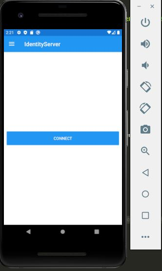

# AbpApiConsumedByXamarin

## Setup BookStore API and IdentityServer

### Create a new ABP project with a separate IdentityServer project

`abp new XamarinBookStoreApi -u blazor -o XamarinBookStoreApi --separate-identity-server`

### Find your IP address

Open a command prompt and enter `ipconfig` to fin you IP address

### replace all instances of localhost with your IP address

Hit CTRL+SHIFT+H to replace all localhost instances in the XamarinBookStoreApi with your IP address

```bash
    https://192.168.1.106:44349" => "https://192.168.1.106:44349"
```


### Add XamarinBookStoreApi_Xamarin section in appsettings.json file of the XamarinBookStoreApi.DbMigrator project

```json
      "XamarinBookStoreApi_Xamarin": {
        "ClientId": "XamarinBookStoreApi_Xamarin",
        "ClientSecret": "1q2w3e*",
        "RootUrl": "https://<your-ip-address>:<port-identityserver>" 
        // RootUrl = "AuthServer:Authority": "https://192.168.1.106:44349" in appsettings.json HttpApi.Host project
      }
```

### Add Xamarin client IdentityServer configuration

In the CreateClientAsync method in class IdentityServerDataSeedContributor of the XamarinBookStoreApi.Domain project

```csharp
  // Xamarin Client
  var xamarinClientId = configurationSection["XamarinBookStoreApi_Xamarin:ClientId"];
  if (!xamarinClientId.IsNullOrWhiteSpace())
  {
      var xamarinRootUrl = configurationSection["XamarinBookStoreApi_Xamarin:RootUrl"].TrimEnd('/');

      await CreateClientAsync(
          name: xamarinClientId,
          scopes: commonScopes,
          grantTypes: new[] { "authorization_code" },
          secret: configurationSection["XamarinBookStoreApi_Xamarin:ClientSecret"]?.Sha256(),
          requireClientSecret: false,
          redirectUri: "xamarinformsclients://callback",
          corsOrigins: new[] { xamarinRootUrl.RemovePostFix("/") }
      );
  }
```

### Update method ConfigureAuthentication of the XamarinBookStoreApiHttpApiHostModule in HttpApi.Host project

To overcome issue _System.InvalidOperationException: IDX20803: Unable to obtain configuration from: 'System.String'.
 ---> System.IO.IOException: IDX20804: Unable to retrieve document from: 'System.String'_  update the ConfigureAuthentication method.

WARNING: Do this only in a development environment, not in a production environment!

```csharp
    private void ConfigureAuthentication(ServiceConfigurationContext context, IConfiguration configuration)
    {
      context.Services.AddAuthentication(JwtBearerDefaults.AuthenticationScheme)
          .AddJwtBearer(options =>
          {
            // ...
            
            options.BackchannelHttpHandler = new HttpClientHandler
            {
              ServerCertificateCustomValidationCallback = HttpClientHandler.DangerousAcceptAnyServerCertificateValidator
            };
          });
    }
```

### DbMigrations

Run the XamarinBookStoreApi.DbMigrator project to apply the database migrations.

### Run Identity, Api and Blazor project

## Create and configure Xamarin.Forms app

### Create a new Xamarin app in Visual Studio


### add FlyoutItem in file AppShell.xaml of the XamarinBookStoreApp core project

```html
    <FlyoutItem Title="IdentityServer" Icon="icon_identity_server.png">
        <ShellContent Route="IdentityConnectPage" ContentTemplate="{DataTemplate local:IdentityConnectPage}" />
    </FlyoutItem>
    // ... other FlyoutItems here
```

### Add a new ContentPage IdentityConnectPage.xaml in the Views folder of the XamarinBookStoreApp core project

```html
<?xml version="1.0" encoding="utf-8" ?>
<ContentPage xmlns="http://xamarin.com/schemas/2014/forms"
             xmlns:x="http://schemas.microsoft.com/winfx/2009/xaml"
             x:Class="XamarinBookStoreApp.Views.IdentityConnectPage"
               Title="{Binding Title}">
    <ContentPage.Content>
        <StackLayout Padding="10,0,10,0" VerticalOptions="Center">
            <Button VerticalOptions="Center" Text="Connect" Command="{Binding ConnectToIdentityServerCommand}"/>
        </StackLayout>
    </ContentPage.Content>
</ContentPage>
```

### Set BindingContext in IdentityConnectPage.xaml.cs in the Views folder

```csharp
using Xamarin.Forms;
using Xamarin.Forms.Xaml;
using XamarinBookStoreApp.ViewModels;

namespace XamarinBookStoreApp.Views
{
    [XamlCompilation(XamlCompilationOptions.Compile)]
    public partial class IdentityConnectPage : ContentPage
    {
        public IdentityConnectPage()
        {
            InitializeComponent();
            this.BindingContext = new IdentityConnectViewModel();
        }
    }
}
```

### Create a new file IdentityConnectViewModel.cs in the ViewModels folder of the XamarinBookStoreApp project

```csharp
using System;
using Xamarin.Forms;

namespace XamarinBookStoreApp.ViewModels
{
    public class IdentityConnectViewModel : BaseViewModel
    {
        public Command ConnectToIdentityServerCommand { get; }

        public IdentityConnectViewModel()
        {
            Title = "IdentityServer";
            ConnectToIdentityServerCommand = new Command(ConnectToIdentityServer);
        }

        private void ConnectToIdentityServer(object obj)
        {
            throw new NotImplementedException();
        }
    }
}
```

### Run the XamarinBookStoreApp to see everything works till now




