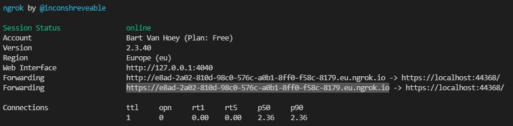
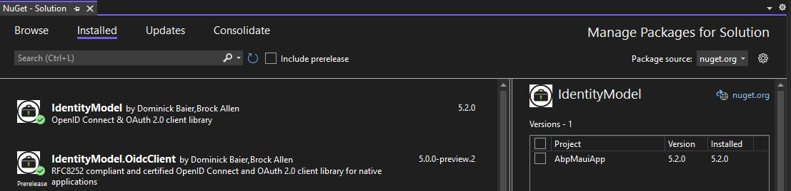

## ABP Framework consumed by a .NET Maui application

## Introduction

In this article I will explain **how to consume an ABP Framework API with a .NET Maui app**.

## Source Code

The sample ABP Framework application has been developed with Blazor as UI framework and SQL Server as database provider.

The Source code of the completed application is [available on GitHub](https://github.com/bartvanhoey/AbpApiConsumedByMaui).

## Requirements

The following tools are needed to be able to run the solution and follow along.
You will also need to have your editor set up for .NET Maui development.

* .NET 5.0 SDK
* VsCode, Visual Studio 2019, or another compatible IDE
* Visual Studio 2022 for the .NET Maui app

## Create a new ABP Framework application

```bash
    abp new AbpApi -u blazor -o AbpApi
```

### BookAppService (optional)

To have a simple API that you can consume with the .NET Maui app, add the Books Bookstore code from the BookStore Tutorial (Part1-5).

### Add an AbpApi_Maui section in appsettings.json file of the AbpApi.DbMigrator project

```json
    // change the <port:abp-api> with the port were the Swagger page is running on
    "AbpApi_Maui": {
        "ClientId": "AbpApi_Maui",
        "ClientSecret": "1q2w3e*",
        "RootUrl": "https://localhost:<port:abp-api>/" 
    }
```

### Add MauiClient IdentityServer configuration

In the CreateClientAsync method in class IdentityServerDataSeedContributor of the AbpApi.Domain project.

```csharp
    // Maui Client
    var mauiClientId = configurationSection["AbpApi_Maui:ClientId"];
    if (!mauiClientId.IsNullOrWhiteSpace())
    {
        var mauiRootUrl = configurationSection["AbpApi_Maui:RootUrl"].TrimEnd('/');
        await CreateClientAsync(
            name: mauiClientId,
            scopes: commonScopes,
            grantTypes: new[] { "authorization_code" },
            secret: configurationSection["AbpApi_Maui:ClientSecret"]?.Sha256(),
            requireClientSecret: false,
            redirectUri: "mauiclients:/authenticated",
            postLogoutRedirectUri: "mauiclients:/signout-callback-oidc",
            corsOrigins: new[] { mauiRootUrl.RemovePostFix("/") }
        );
    }
```

### Insert MauiClient settings into Database

Run AbpApi.DbMigrator project to execute the IdentityServerDataSeedContributor to insert the MauiClient settings into the database.

### Start API and Blazor project

Start API and Blazor project to see if all projects are running successfully. Keep API running!

## Download & setup ngrok

With ngrok you can mirror your localhost API endpoint to a worldwide available API endpoint.
In this way you can overcome the problem .NET Maui app mixing up localhost from the API with localhost from the .NET Maui app.

### Open a command prompt in the root of ABP Framework application and run the command below

```bash
    -- specify another region when needed
    ngrok http -region eu https://localhost:<port:abp-api>/ 
```



### Copy and remember Ngrok Forwarding https endpoint

```bash
    "https://<your-ngrok-generated-generated-number-here>.eu.ngrok.io"
```

## Create a new .NET Maui application

### Create a new Maui app in Visual Studio 2022

Create a new .NET Maui app with the name **AbpMauiApp** in Visual Studio 2022.

### Run .NET Maui application

Start the .NET Maui application and stop it again when it runs successfully.

## Connect to AbpApi IdentityServer

### Install IdentityModel, IdentityModel.OidcClient and Newtonsoft.json nuget packages

Open Nuget Package Manager and install **IdentityModel** and **IdentityModel.OidcClient** nuget packages in the core project.



### Add a Services folder in root of the .NET Maui app

### Add a WebAuthenticatorBrowser class to the Services folder

This class is needed to open a browser page in your .NET Maui application.

```csharp
using System;
using System.Linq;
using System.Threading;
using System.Threading.Tasks;
using IdentityModel.OidcClient.Browser;
using Microsoft.Maui.Essentials;

namespace AbpMauiApp.Services
{
    internal class WebAuthenticatorBrowser : IBrowser
    {
        private readonly string _callbackUrl;

        public WebAuthenticatorBrowser(string callbackUrl = null) => _callbackUrl = callbackUrl ?? "";

        public async Task<BrowserResult> InvokeAsync(BrowserOptions options, CancellationToken cancellationToken = default)
        {
            try
            {
                var callbackUrl = string.IsNullOrEmpty(_callbackUrl) ? options.EndUrl : _callbackUrl;
                var authResult =
                    await WebAuthenticator.AuthenticateAsync(new Uri(options.StartUrl), new Uri(callbackUrl));
                var authorizeResponse = ToRawIdentityUrl(options.EndUrl, authResult);
                return new BrowserResult
                {
                    Response = authorizeResponse
                };
            }
            catch (Exception exception)
            {
                
                return new BrowserResult
                {
                    ResultType = BrowserResultType.UnknownError,
                    Error = exception.ToString()
                };
            }
        }

        private static string ToRawIdentityUrl(string redirectUrl, WebAuthenticatorResult result)
        {
            var parameters = result.Properties.Select(pair => $"{pair.Key}={pair.Value}");
            var values = string.Join("&", parameters);
            return $"{redirectUrl}#{values}";
        }
    }
}
```

### Add a LoginService class to the Services folder

```csharp
using AbpMauiApp.Services;
using IdentityModel.OidcClient;
using System.Threading.Tasks;

namespace AbpMaui.Services
{
    public class LoginService
    {
        private const string _authorityUrl = "https://7bb4-2a02-810d-98c0-576c-a0b1-8ff0-f58c-8179.eu.ngrok.io";
        private const string _redirectUrl = "mauiclients:/authenticated";
        private const string _postLogoutRedirectUrl = "mauiclients:/signout-callback-oidc";
        private const string _scopes = "email openid profile role phone address AbpApi";
        private const string _clientSecret = "1q2w3e*";
        private const string _clientId = "AbpApi_Maui";


        private OidcClient CreateOidcClient()
        {
            var options = new OidcClientOptions
            {
                Authority = _authorityUrl,
                ClientId = _clientId,
                Scope = _scopes,
                RedirectUri = _redirectUrl,
                ClientSecret = _clientSecret,
                PostLogoutRedirectUri = _postLogoutRedirectUrl,
                Browser = new WebAuthenticatorBrowser()
            };
            return new OidcClient(options);
        }

        public async Task<string> AuthenticateAsync()
        {
            var oidcClient = CreateOidcClient();
            var loginResult = await oidcClient.LoginAsync(new LoginRequest());
            return loginResult.AccessToken;
        }
    }
}

```

### Replace content of the MainPage.xaml file

```html
<ContentPage xmlns="http://schemas.microsoft.com/dotnet/2021/maui"
             xmlns:x="http://schemas.microsoft.com/winfx/2009/xaml"
             x:Class="AbpMauiApp.MainPage"
             BackgroundColor="{DynamicResource SecondaryColor}">

    <ScrollView>
        <Grid RowSpacing="25" RowDefinitions="Auto"
              Padding="{OnPlatform iOS='30,60,30,30', Default='30'}">
            <Button 
                Text="Login"
                FontAttributes="Bold"
                Grid.Row="3"
                Clicked="OnLoginClicked"
                HorizontalOptions="Center" />
        </Grid>
    </ScrollView>
</ContentPage>
```

### Replace content of the MainPage.xaml.cs class

```csharp
using System;
using System.Collections.Generic;
using System.Linq;
using System.Net.Http;
using AbpMaui.Services;
using IdentityModel.Client;
using Microsoft.Maui.Controls;
using Newtonsoft.Json;

namespace AbpMauiApp
{
    public partial class MainPage : ContentPage
    {
        private readonly LoginService _loginService = new();

        public MainPage()
        {
            InitializeComponent();
        }

        private async void OnLoginClicked(object sender, EventArgs e)
        {
            var accessToken = await _loginService.AuthenticateAsync();
            Console.WriteLine($"accesstoken: {accessToken}");

            var httpClient = GetHttpClient(accessToken);
            var response = await httpClient.Value.GetAsync("https://7bb4-2a02-810d-98c0-576c-a0b1-8ff0-f58c-8179.eu.ngrok.io/api/app/book");
            if (response.IsSuccessStatusCode)
            {
                var content = await response.Content.ReadAsStringAsync();
                var booksResult = JsonConvert.DeserializeObject<BooksResult>(content);

                var book = booksResult.Items.FirstOrDefault();
                // Set a breakpoint on the line below
                var bookDetail = $"book: {book.Name} - price: {book.Price}";
            }
        }

        private static Lazy<HttpClient> GetHttpClient(string accessToken)
        {
            var httpClient = new Lazy<HttpClient>(() => new HttpClient(MainPage.GetHttpClientHandler()));
            httpClient.Value.SetBearerToken(accessToken);
            return httpClient;
        }

        private static HttpClientHandler GetHttpClientHandler()
        {
            //////////////////////////////////////////////////////////////////////////////////////////////////////////////////////////////////////////////////
            // EXCEPTION : Javax.Net.Ssl.SSLHandshakeException: 'java.security.cert.CertPathValidatorException: Trust anchor for certification path not found.'
            // SOLUTION :
            var httpClientHandler = new HttpClientHandler
            {
                ServerCertificateCustomValidationCallback = (message, cert, chain, errors) => true
            };
            return httpClientHandler;
        }
    }

    public class BooksResult
    {
        public int TotalCount { get; set; }
        public List<BookDto> Items { get; set; }
    }

    public class BookDto
    {
        public Guid Id { get; set; }
        public string Name { get; set; }
        public BookType Type { get; set; }
        public DateTime PublishDate { get; set; }
        public float Price { get; set; }
        public DateTime? LastModificationTime { get; set; }
        public Guid? LastModifierId { get; set; }
    }

    public enum BookType
    {
        Undefined,
        Adventure,
        Biography,
        Dystopia,
        Fantastic,
        Horror,
        Science,
        ScienceFiction,
        Poetry
    }
}

```

## Run .NET Maui application to see it working

Update the **_authorityUrl** field in the LoginService class with the correct **ngrok Forwarding https url** and run the Maui application on an emulator or physical device.

If all goes well, your Maui application opens a browser window where you need to authenticate with your administrator credentials (admin - 1q2w3E*). Once logged in, the app makes a call to the ABP Framework API that returns the books from the database.


Et voilà! As you can see  in the animated gif the .NET Maui app successfully retrieves data from the database by connecting to the IdentityServer4 and consuming the ABP Framework API.

Get the [source code](https://github.com/bartvanhoey/AbpApiConsumedByMaui) on GitHub.

Enjoy and have fun!
